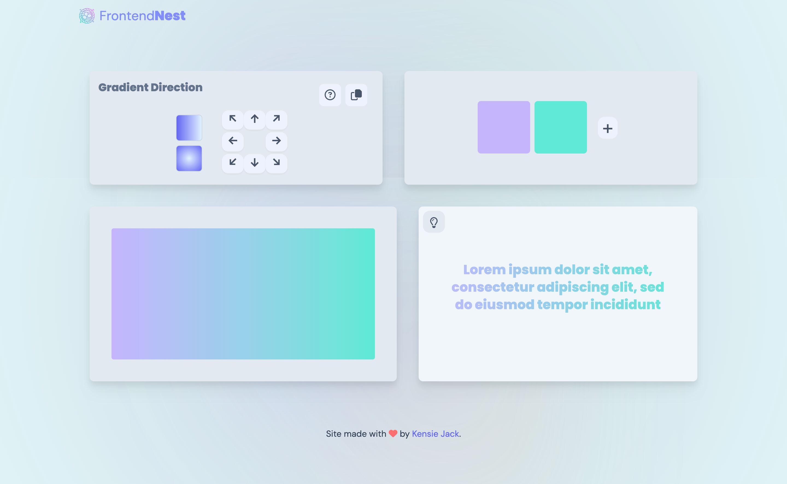

# **Frontend Nest**

A tool suite for web developers to easily store and access commonly used class names, generate gradients, and get components.

## Goals for this project

- Friendly and colorful visual style, easy to navigate, memorable
- Highlight functionality
- Show static React sites

## Color Reference

| Color    | Hex                                                              |
| -------- | ---------------------------------------------------------------- |
| leaf     |  #39603d |
| greenish |  #b6b782 |
| storm    |  #daded4 |
| jade     |  #a3bcb6 |
| charcoal |  #3c403d |

## **Acknowledgements**

- [Unsplash](https://unsplash.com/) for all the photographs.
- [Coolers](https://coolors.co/) for color palette inspiration.
- [Optimizilla](https://imagecompressor.com/) for image compression.
- This is a [Next.js](https://nextjs.org/) project bootstrapped with [`create-next-app`](https://github.com/vercel/next.js/tree/canary/packages/create-next-app).

## Run dev

Set up your .env file

- Google OAuth connection
  - GOOGLE_ID
  - GOOGLE_CLIENT_SECRET
- MongoDB connection
  - MONGODB_URI
- NextAuth configuation
  - NEXTAUTH_SECRET = a random string generated in CLI
  - NEXTAUTH_URL = http://localhost:3000 or your Next localhost address
  - NEXTAUTH_URL_INTERNAL = http://localhost:3000 or your Next localhost address

Run npm i to install dependancies

Code!
